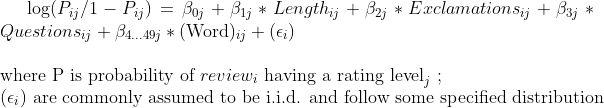

```{r setup, include=FALSE}
knitr::opts_chunk$set(echo = TRUE)
```


```{r, include=FALSE}
library("dplyr")
library("stringr")
library("anytime")
library("tm")
library("SnowballC")
library("wordcloud")
library("RColorBrewer")
library("syuzhet")
library("ggplot2")
library("randomForest")
library("randomForestExplainer")
library("caret")
library("knitr")
library("broom")
library("nnet")
library("kableExtra")
library("car")
```

```{r load data, include=FALSE}
raw <- read.csv("raw_yelp_review_data.csv")
```

```{r mutate, include=FALSE}
raw <- raw %>%
  mutate(rating = as.factor(substr(raw$star_rating, 1, 2)),
         rating.level = as.factor(case_when(as.numeric(rating) == 5 ~ "Positive",
                                  as.numeric(rating) == 4 ~ "Neutral",
                                  as.numeric(rating) <= 3 ~ "Negative")),
         length = nchar(as.character(raw$full_review_text)),
         exclamations = str_count(raw$full_review_text, "!"),
         questions = str_count(raw$full_review_text, "\\?")
         )
data <- raw
```

```{r text, include=FALSE}
data$full_review_text <- as.character(data$full_review_text)
text <- data$full_review_text
text <- tolower(text)
text <- removeNumbers(text)
text <- removePunctuation(text)
text <- removeWords(text, stopwords("english"))
text <- stripWhitespace(text)
text <- stemDocument(text)
data$full_review_text <- text

corpus <- Corpus(VectorSource(data$full_review_text)) # turn into corpus

tdm <- TermDocumentMatrix(corpus) # create tdm from the corpus

top_terms <- findFreqTerms(tdm,1000)

# sort(top_terms)

data <- data %>%
  mutate(always = case_when(grepl("alway", full_review_text, fixed=TRUE) ~ 1,
                             TRUE ~ 0),
         austin = case_when(grepl("austin", full_review_text, fixed=TRUE) ~ 1,
                             TRUE ~ 0),
         back = case_when(grepl("back", full_review_text, fixed=TRUE) ~ 1,
                             TRUE ~ 0),
         barista = case_when(grepl("barista", full_review_text, fixed=TRUE) ~ 1,
                             TRUE ~ 0),
         checkin = case_when(grepl("checkin", full_review_text, fixed=TRUE) ~ 1,
                             TRUE ~ 0),
         coffee = case_when(grepl("coff", full_review_text, fixed=TRUE) ~ 1,
                             TRUE ~ 0),
         come = case_when(grepl("come", full_review_text, fixed=TRUE) ~ 1,
                             TRUE ~ 0),
         day = case_when(grepl("day", full_review_text, fixed=TRUE) ~ 1,
                             TRUE ~ 0),
         definite = case_when(grepl("definit", full_review_text, fixed=TRUE) ~ 1,
                             TRUE ~ 0),
         drink = case_when(grepl("drink", full_review_text, fixed=TRUE) ~ 1,
                             TRUE ~ 0),
         flavor = case_when(grepl("flavor", full_review_text, fixed=TRUE) ~ 1,
                             TRUE ~ 0),
         food = case_when(grepl("food", full_review_text, fixed=TRUE) ~ 1,
                             TRUE ~ 0),
         friend = case_when(grepl("friend", full_review_text, fixed=TRUE) ~ 1,
                             TRUE ~ 0),
         get = case_when(grepl("get", full_review_text, fixed=TRUE) ~ 1,
                             TRUE ~ 0),
         good = case_when(grepl("good", full_review_text, fixed=TRUE) ~ 1,
                             TRUE ~ 0),
         got = case_when(grepl("got", full_review_text, fixed=TRUE) ~ 1,
                             TRUE ~ 0),
         great = case_when(grepl("great", full_review_text, fixed=TRUE) ~ 1,
                             TRUE ~ 0),
         ice = case_when(grepl("ice", full_review_text, fixed=TRUE) ~ 1,
                             TRUE ~ 0),
         latte = case_when(grepl("latt", full_review_text, fixed=TRUE) ~ 1,
                             TRUE ~ 0),
         like = case_when(grepl("like", full_review_text, fixed=TRUE) ~ 1,
                             TRUE ~ 0),
         little = case_when(grepl("littl", full_review_text, fixed=TRUE) ~ 1,
                             TRUE ~ 0),
         look = case_when(grepl("look", full_review_text, fixed=TRUE) ~ 1,
                             TRUE ~ 0),
         lot = case_when(grepl("lot", full_review_text, fixed=TRUE) ~ 1,
                             TRUE ~ 0),
         love = case_when(grepl("love", full_review_text, fixed=TRUE) ~ 1,
                             TRUE ~ 0),
         nice = case_when(grepl("nice", full_review_text, fixed=TRUE) ~ 1,
                             TRUE ~ 0),
         order = case_when(grepl("order", full_review_text, fixed=TRUE) ~ 1,
                             TRUE ~ 0),
         park = case_when(grepl("park", full_review_text, fixed=TRUE) ~ 1,
                             TRUE ~ 0),
         people = case_when(grepl("peopl", full_review_text, fixed=TRUE) ~ 1,
                             TRUE ~ 0),
         place = case_when(grepl("place", full_review_text, fixed=TRUE) ~ 1,
                             TRUE ~ 0),
         pretty = case_when(grepl("pretti", full_review_text, fixed=TRUE) ~ 1,
                             TRUE ~ 0),
         really = case_when(grepl("realli", full_review_text, fixed=TRUE) ~ 1,
                             TRUE ~ 0),
         seat = case_when(grepl("seat", full_review_text, fixed=TRUE) ~ 1,
                             TRUE ~ 0),
         service = case_when(grepl("servic", full_review_text, fixed=TRUE) ~ 1,
                             TRUE ~ 0),
         shop = case_when(grepl("shop", full_review_text, fixed=TRUE) ~ 1,
                             TRUE ~ 0),
         spot = case_when(grepl("spot", full_review_text, fixed=TRUE) ~ 1,
                             TRUE ~ 0),
         staff = case_when(grepl("staff", full_review_text, fixed=TRUE) ~ 1,
                             TRUE ~ 0),
         sweet = case_when(grepl("sweet", full_review_text, fixed=TRUE) ~ 1,
                             TRUE ~ 0),
         table = case_when(grepl("tabl", full_review_text, fixed=TRUE) ~ 1,
                             TRUE ~ 0),
         taste = case_when(grepl("tast", full_review_text, fixed=TRUE) ~ 1,
                             TRUE ~ 0),
         tea = case_when(grepl("tea", full_review_text, fixed=TRUE) ~ 1,
                             TRUE ~ 0),
         time = case_when(grepl("time", full_review_text, fixed=TRUE) ~ 1,
                             TRUE ~ 0),
         try = case_when(grepl("tri", full_review_text, fixed=TRUE) ~ 1,
                             TRUE ~ 0),
         want = case_when(grepl("want", full_review_text, fixed=TRUE) ~ 1,
                             TRUE ~ 0),
         well = case_when(grepl("well", full_review_text, fixed=TRUE) ~ 1,
                             TRUE ~ 0),
         will = case_when(grepl("will", full_review_text, fixed=TRUE) ~ 1,
                             TRUE ~ 0),
         work = case_when(grepl("work", full_review_text, fixed=TRUE) ~ 1,
                             TRUE ~ 0)
  )
data$anyword <- rowSums(data[, 9:54])
```


# Intro

***Background***

Yelp is a website founded in 2004 where users can submit reviews of businesses. The reviews are from a 1-5 star scale system with 1 indicating the worst experience and 5 indicating the best experience. In these reviews, "Yelpers", can also write about their experiences and share photos from their trips to restaurants, coffeeshops, barbers, bars, or other personal services. These reviews are valuable in a variety of ways: they can inform other people of the quality of the experience at said business, they can be a diary for the reviewer to reflect on their experiences, and they can help local businesses receive valuable feedback. In fact, one study claimed that a one-star increase in Yelp rating led to a 5-9% increase in revenue in the Seattle area from 2004-2009 (Luca, 2011). With Yelp reviews being valuable to both customers and businesses, it is important to understand what aspects of a review are associated with negative, neutral, and positive ratings. Are certain words or ways to describe Yelper's experiences good predictors of their rating? Specifically, the interests of this study is to **analyze components of Yelp written reviews to understand the differences in how negative, neutral, and positive ratings are given.**


***Data***

The data for this study is comprised of 7616 individual Yelp reviews that span 79 coffee shops in the Austin, TX area. All previous reviews (with some going back to 2006) were scraped for coffee shops that were operational in 2016. The name of the coffee shop, text of the review, and star ratings were recorded. The star ratings were given a level attribute with 3 stars or less being "Negative", 4 stars being "Neutral", and 5 stars being "Positive." Even though 3 stars is the numerical average of the 5-star system, Yelp has reported that average rating is actually closer to 4, 3.77 to be exact (Bialik, 2018).

A text analysis was conducted with this dataset.
Firstly, the original length, the number of exclamations, and the number of question marks in the reviews were recorded as their own variables. These were the characteristics of Yelp reviews that were particularly interesting as they might be indicators of Yelper's emotions besides their words. For example, perhaps reviewers will be more lively and positive in reviews with many exclamation points, thus their ratings are more likely to be 5s. Additionally, researchers claim that in sentiment analysis, exclamations should be taken into account as they are indicative of emotion, sometimes more than the words themselves (Teh et al, 2015). Critical reviews might be characterized by long rambling rants that point out all the flaws of the coffee shop, and therefore longer reviews will be associated with bad ratings. 
Then through a cleaning process, as well as a method known as "stemming," non-common words with at least 1000 occurrences throughout the reviews were made into binary variables. The full list of words as well as a more detailed walkthrough can be found in Appendix 1.  


***Hypothesis***

Based on anecdotal usage of Yelp as well as some exploratory analysis, we hypothesize that negative reviews (3 stars or lower) will be associated with more characters and words related to service, neutral reviews (4 stars) will be associated with many nouns or descriptive words, and positive reviews (5 stars) will be associated with many action words as well as high usage of exclamation points.

\newpage

**Figure 1. Distribution of Exclamation Points by Rating**

```{r, echo=FALSE, warning=FALSE, fig.height = 3}
ggplot(data, aes(x=rating.level, y=exclamations)) +
  geom_boxplot() + 
  labs(x = 'Rating',
       y = 'Number of Exclamation Points') 
```

Figure 1 displays the distribution of exclamation points in a given review separated by the 3 levels of ratings. We see that positive reviews have a higher median number of exclamation points as well as a greater frequency of high exclamation point reviews, with a maximum of 76 exclamation points in 1 review. This aligns with our hypothesis that positive reviews are generally more exciteable and therefore have more exclamation points.

**Figure 2. Length of Review by Rating**

```{r, echo=FALSE, warning=FALSE, fig.height = 3}
ggplot(data, aes(x=rating.level, y=length)) +
  geom_boxplot() + 
  labs(x = 'Rating',
       y = 'Length of Review (characters)') 
```

Figure 2 depicts the distribution of length of characters for a given review separated by the 3 levels of ratings. We see that the neutral reviews and then positive reviews have fewer number of characters than negative reviews. This sentiment that negative reviews are comprised of longer complaints seem to hold in this coffee shop dataset, which is actually in line with the findings of Yelp in 2018 (Bialik, 2018).

**Table 1: Frequency of Key Words**

```{r, echo=FALSE, warning=FALSE}
table1 <- data %>%
  group_by(rating.level) %>%
  summarise(n = n(),
            barista = sum(barista)/n(),
            like = sum(like)/n(),
            love = sum(love)/n(),
            nice = sum(nice)/n(),
            pretty = sum(pretty)/n(),
            service = sum(service)/n()
            ) 
colnames(table1) <- c("Rating Level", "Reviews", "Barista", "Like","Love","Nice","Pretty","Service")
kable(table1, digits = 3)
```

As a precursor to our model and analysis, some words such as "barista", "like", "love", "nice", "pretty", and "service" were chosen to get a glimpse as to how these words are distributed in different types of reviews. In order to compare the frequency of these words, the percentage frequency of the word in that rating level was used. Service-related words such as "barista" and "service" were found at a higher rate in negative reviews. Interestingly, the positive descriptors of "like" and "pretty" were found at increasingly higher rates as the reviews turned more negative. Perhaps this might indicate other usage of these words such as "did not like" or "pretty awful."


# Methodology

In order to analyze and identify the differences in how negative, neutral, and positive ratings were given we decided to fit 3 logistic regression models. The logistic regression models would be fitted for each type of rating (Negative, Neutral, and Positive), to analyze and compare common words found in Yelp reviews. We decided not to use other model types and our rationale is as follows:

Multinomial Logistic Regression: While a multinomial logistic regression could have been used, the model output would compare each rating level in relation to the baseline. We decided that this consequently would hinder our goals for the analysis as we hypthosized specific aspects of reviews to be significantly associated with a given rating. The interpretability of the multinomial logistic regression is also not as direct as the Binary logistic regression.

Ordinal Logistic Regression: Similarly to the multinomial logistic regression, an ordinal logistic regression compares each level to the previous one. While inherently this might be useful to compare 1 star to 2 star to 3 star and so on, there is less application for the sake of our case study. Additionally, the ordinal logistic regression can indicate significant predictors overall but would not distinguish that X word is significantly correlated with negative reviews while Y word is significantly correlated with positive ones.

Random Forest: This was used in the first rendition of the analysis and although the use of ML is powerful for categorization, there is limited interpretability. The random forest approach can allow for identification of "important" terms but the meaning of "important" is rather convoluted and does not provide insights as to how a negative rating differs from a positive one. Therefore, opting for a more simpler and explainable model was preferred. 

For each of the logistic regression models, the rating was the response variable with a 1 indicating that the review was the rating of focus and a 0 otherwise. So in the first logistic model on predicting negative reviews, a 1 would be a review of rating 3 or less and a 0 otherwise. The length, number of exclamation points, and number of question marks were predictors as well as the 46 most common stem words identified in the text analysis.

Conducting 3 logistic regression models allows us to compare each rating independently as opposed to in direct relation with each other (ie Negative to Neutral). This approach also allows us to identify significant variables for each of the rating level since some words might be more correlated with say a positive or negative rating than a neutral one. Additionally, because the comparisons can be done with more flexibility, identifying common significant words has meaningful interpretability. For example, if a word or review characteristic is deemed significant for positive and negative ratings, this most likely means that the word is a signifier of extremeness or a strong opinion, which might be helpful to identify when understanding reviews. The assumptions for logistic regression model were satisfied and are further outlined in Appendix 2. 

The mathematical form of the models are as follows:



\newpage
# Results
```{r, include=FALSE}
data.negative <- data %>%
  mutate(rating.level = case_when(rating.level == "Negative" ~ 1,
                             TRUE ~ 0)) %>%
  select(-c(coffee_shop_name, full_review_text, star_rating, rating, anyword))

data.neutral <- data %>%
  mutate(rating.level = case_when(rating.level == "Neutral" ~ 1,
                             TRUE ~ 0)) %>%
  select(-c(coffee_shop_name, full_review_text, star_rating, rating, anyword))

data.positive <- data %>%
  mutate(rating.level = case_when(rating.level == "Positive" ~ 1,
                             TRUE ~ 0)) %>%
  select(-c(coffee_shop_name, full_review_text, star_rating, rating, anyword))
```
**Table 2: Statistically Significant Coefficients of Logistic Regression Models (exponentiated, $\alpha$ = .05)**
```{r, echo=FALSE, warning=FALSE}
model.negative <- glm(rating.level ~ ., data = data.negative, family = binomial)
tidy.negative <- tidy(model.negative, exponentiate = TRUE)
model.neutral <- glm(rating.level ~ ., data = data.neutral, family = binomial)
tidy.neutral <- tidy(model.neutral, exponentiate = TRUE)
model.positive <- glm(rating.level ~ ., data = data.positive, family = binomial)
tidy.positive <- tidy(model.positive, exponentiate = TRUE)

rbind(tidy.negative, tidy.neutral, tidy.positive) %>%
  group_by(term) %>%
  dplyr::select(-statistic) %>% 
  filter(p.value < 0.05)  %>%
  mutate(across(where(is.numeric), ~ round(.x, digits = 3))) %>%
  mutate(p.value = ifelse(p.value < 0.001, "<0.001", sprintf("%0.3f", p.value))) %>%
  select(term, estimate, std.error, p.value) %>%
  kable(format = "latex", booktabs = T, longtable = T,
      col.names = c("Term", "Estimate", "Standard Error",
                      "P-Value"),
      digits = 3, centering = FALSE,
      align = "lrrr") %>%
  row_spec(0, bold = TRUE) %>%
  pack_rows("Negative Model", 1, 26, bold = T) %>%
  pack_rows("Neutral Model", 27, 48, bold = T) %>%
  pack_rows("Positive Model", 49, 72, bold = T) %>%
  kable_styling(latex_options = c("repeat_header"))

```


The 3 logistic regression models' significant coefficients were put into 1 table but the full table can be found in Appendix 3. At a high level, 25 predictors (excluding intercepts) were identified as significant in the Negative logistic regression model, 21 in the Neutral, and 23 in the Positive. The predictor variables of: length, exclamations, questions, always, austin, checkin, friend, great, love, pretty, and seat were all significant across the three models. Because the model output is exponentiated, whenever the estimate is greater than 1, the odds that the response variable is the rating of interest increases. Similarly, when the estimate is less than 1, the odds that the response variable is the rating of interest decreases.

For the exclamation predictor, the 0.648 as the coefficient in the Negative Model can be interpretted as: for each exclamation present in a review, holding all else constant, the odds that the review rating is negative decreases by a factor of .648. On the opposite end however, for each exclamation present in a review, holding all else constant,the odds that the review rating is positive increases by a factor of 1.244.

For the indicator variables of the words, the interpretation is very similar. If in a review, the word "love" is present, holding all else constant, the odds that the review rating is negative decreases by a factor of .502 while the odds that the review rating is positive increases by 1.726.


# Discussion

Observing the commonalities of significant variables as well as the differences in significant predictors identified is quite interesting. An important aspect to note is that just because a word was not significant in one model, does not make the word somehow "less important" overall. Simply, a signficant predictor has a signficant association with the response in one way or another. The key to interpreting all of these variables is to also pay attention to the direction of significance (less than or greater to 1). 

Following our original hypotheses:

### Negative Ratings:
"Negative reviews (3 stars or lower) will be associated with more characters and words related to service." Due to the rounding in the table, all reviews had a coefficient estimate of approximately 1 regarding for the predictor length. However with more significant figures, the coefficients are 1.0011959, 0.9996356, and 0.9995032	for the Negative model, Neutral model, and Positive model respectively. This supports our hypothesis that as the character count increases, so do odds that the review will be negative. Words relating to service that were significant were "order" and "service", both of which were the two highest coefficient estimate in predicting negative ratings at 1.781 and 1.842 respectively. An interesting part to note was that of the adjectives/adverbs "always", "definite", "great", "like", "little", "love", "pretty", "sweet", and "well", only "like" and "pretty" had a coefficient greater than 1. This might be telling in how the words were used. For example, "like" can be used in the context of "I didn't like X" but also could be used in a sentence such as "the coffee tasted like dirt." Similarly, "pretty" may be used in a scenario such as "the coffee shop was so pretty" but also "that was a pretty awful experience." One can imagine how these two words were used in negative ratings as opposed to more positive ones. 

### Neutral Ratings:
"Neutral reviews (4 stars) will be associated with many nouns or descriptive words." The motivation behind this hypothesis was that neutral reviews were direct, factual, and balanced, unlike the emotional nature of positive and negative reviews. Stronger descriptive words such as "always" and "love" were associated with a decrease in odds of a neutral review which intuitively makes sense. If a reviewer says they "love" a drink or "always is disappointed," they will not likely be rating the coffee shop a neutral 4 rating. On the other hand, the presence of adjectives such as "friend" (most likely stemming from "friendly"), "good", "great", "little", "pretty", and "sweet", which all do not have a strong voice behind them, increases the odds of positive ratings. Neutral reviews were thought to be more factual, and nouns such as "ice", "seat", and "table" were identified as significant and positively correlated with netural ratings. However, it was rather surprising not to see "coffee", "drink", "food", "latte", or "tea" (products of coffee shops) not identified as significant. The predictor of neutral rated reviews that was most interesting however is "checkin." The single most influential word to predict a 4 star review is the presence of "checkin," which in the raw file, denoted that the user checked-in to the coffee shop. Check-ins are a feature that allow Yelpers to share that they have visited the location of a business, and are more likely to be used by active or frequent users of Yelp. Therefore, the act of checking-in suggests that the reviewer is not a one-time user wanting to vent about a bad experience or give extreme praise, and therefore has a higher likelihood of a neutral review.

### Positive Ratings:
"Positive reviews (5 stars) will be associated with many action words as well as high usage of exclamation points" is somewhat supported. The verbs "got", like", "love", "order", "park", and "will" were identified as significant; however, the words "got", "like", "order", and "park" were all associated with lowering the odds of positive ratings. The original hypothesis associated verbs with intentional and active story-telling that might be characterstic of a positive review. In actuality, only the most inherently positive verb of "love" and the future-determined verb of "will" were associated with positive ratings. Also, it was in line with our original hypothesis that exclamation points increase odds of positive ratings. Interestingly, the presence of the word "Austin" increased the odds of positive ratings. Perhaps this might be from many reviews lauding the coffee shop as being "the best in Austin" or the like.


We set out to analyze Yelp reviews and understand the differences in how negative, neutral, and positive ratings are given. Our models support the notion that Negative ratings (3 stars or less) were largely long rants that complained about service rather than the product; Neutral ratings were mellow, do not have many opinionated words, and were from the most active users via check-ins; and Positive ratings could be identified by the frequent usage of exclamation points, reference to their city (in this case Austin), and had strong positive words such as "love" and "will."

Of course this analysis is only as good as the data, and while the methodology and justification for the logistic regression were outlined, there is still much limitation with the data. While focusing on one city has its benefits in terms of understanding local tastes, regional dialects may play a role into how the conclusions of this analysis can be extrapolated to other markets. Perhaps the assertion that the word "like" is associated with a decrease in odds of a negative rating, will not apply in California where the word "like" is used more frequently in everyday speech/written pattern. Additionally, the text analysis, while structured, does not take into account the nuances found in different connotations of the word. As per the discussion above, the word "pretty" can be used in both positive and negative contexts that is difficult to discern. Perhaps in future analyses, there can be ways to identify if a word is being used in a positive, neutral, or negative way depending on its place in a sentence. Lastly, the filtering of 1000 or more occurences is arbitrary and if possible, we would like to see all words and sentiments being taken into account in the model. The most common words were used to provide interpretability and simplicity to our models (since it would be difficult to put >100 words for each model); however, it would be just as interesting to find out if there are words characteristic of a certain level of rating. Maybe the word "hate" is exclusive to 1 or 2 star ratings which then can be a quick search word for users to filter out or filter in those reviews. Thinking further perhaps incorporating time data will be an informative layer in understanding the tastes of a population. The sudden increase in the word "oat" may signal a demand for oatmilk or nondairy options in coffee shops which businesses can respond to accordingly.

Despite the limitations of our analysis and the desire to do more, the conclusions and methods utilized in this case study were quite informative and meaningful.


\newpage
## References 

1. Bialik, Carl (Sep 2018). Restaurant Ratings On Yelp Are Remarkably Consistent, No Matter Who’s Writing Them, When, And Where. Yelp Blog. Retrieved https://blog.yelp.com/news/restaurant-ratings-on-yelp-are-remarkably-consistent-no-matter-whos-writing-them-when-and-where/

2. Chakfin, Max (Oct 2009). You've Been Yelped. Inc Magazine. Retrieved https://www.inc.com/magazine/20100201/youve-been-yelped.html

3. Li, Y., Wang, Z., Yu, Z., Popularity Growth Analysis and Prediction on Yelp. Stanford University. Retrieved http://snap.stanford.edu/class/cs224w-2018/reports/CS224W-2018-56.pdf

4. Luca, Michael (2011). Reviews, Reputation, and Revenue: The
Case of Yelp.com. Harvard Business School. Retrieved https://www.hbs.edu/ris/Publication%20Files/12-016_a7e4a5a2-03f9-490d-b093-8f951238dba2.pdf

5. Oheix, Jonathan (Dec 2018). Detecting bad customer reviews with NLP. Towards Data Science. Retrieved https://towardsdatascience.com/detecting-bad-customer-reviews-with-nlp-d8b36134dc7e

6. Teh, P.L., Pak, I., Rayson, P., Piao, S. (Dec 2015). Sentiment Analysis Tools Should Take Account of the Number of Exclamation Marks!!!. IIWAS. Retrieved https://www.researchgate.net/publication/284390575_Sentiment_Analysis_Tools_Should_Take_Account_of_the_Number_of_Exclamation_Marks

7. Yu, B., Zhou, J., Zhang, Y., Cao Y. Identifying Restaurant Features via Sentiment
Analysis on Yelp Reviews. Center for Urban Science & Progress - New York University. Retrieved
https://arxiv.org/pdf/1709.08698.pdf

8. Zhang, Zhiwei (Dec 2017). Machine Learning and Visualization with Yelp Dataset. Medium. Retrieved https://medium.com/@zhiwei_zhang/final-blog-642fb9c7e781

\newpage

## Appendix 1: Process of text analysis and terms 


After the creation of new variables length, exclamations, and questions, we took all the text and transformed them to lowercase to help make analyzing text a bit more manageable.
We removed excess numbers, punctuation, and stop words (which are words that are common in the English language such as "the" and "so"). These stop words were from the tm package.
Next, we identified "stems" of the remaining words. This stemming process is used in text analysis so that words such as "decorated" and "decorations" are identified as the same word, since they both would be used in a similar manner to describe the decor of the coffeehouse. From there, we identified stem words with at least 1000 occurrences throughout the dataset. This 1000 in itself is arbitrary but since there are >7000 reviews, we believed that if words are in 1/7 of total reviews (including double counts), it should be considered in our model. 

On the next page are the 46 stem words with over 1000 occurrences in the data.
```{r, echo=FALSE, warning=FALSE}
kable(sort(top_terms), col.names = "Term", caption = "Terms with over 1000 instances in reviews")
```


## Appendix 2 Model Assumptions for Logistic Regression


Assumptions under logistic regression:

1) The outcome is a binary or dichotomous variable: This assumption is satisfied as we created an indicator of success based on whether the rating level was the desired level in the respective model.

2) Observations are independent: This assumption was not satisfied as we do not expect independence between Yelpers' reviews since users can view other reviews and thus be influenced in how they discuss and rate coffee shops. However, this not immediately present a big problem for our analysis due to the wide range in dates the reviews are pulled from as well as the large number of reviews in general.

3) Linear relationship between the logit of the outcome and each predictor variables: this assumption is satisfied as seen in the Predictor Value vs Logit of Outcome plot. Though there appears to be some polynomial relationships, the relationship is largely linear and thus we consider the assumption satisfied.

4) No influential values (extreme values or outliers) in the continuous predictors: this assumption is satisfied as the top 3 most influential points have relatively low Cook's distances in each of the models.

5)  No high intercorrelations (i.e. multicollinearity) among the predictors: this assumption is satisfied via VIF analysis, which results in relatively low VIF values for each of the predictors.


\newpage
***Figure 3: Linear Relationship between Logit Outcome and Continuous Predictor Variables***
```{r, echo=FALSE, warning=FALSE, message = FALSE}
assumptions.negative <- data.negative %>%
  dplyr::select(length, exclamations, questions) #selecting continuous predictors
predictors.negative <- colnames(assumptions.negative)
probabilities.negative <- predict(model.negative, type = "response")
assumptions.negative <- assumptions.negative %>%
  mutate(logit = log(probabilities.negative/(1-probabilities.negative))) %>%
  tidyr::gather(key = "predictors.negative", value = "Predictor.value", -logit)
ggplot(assumptions.negative, aes(logit, Predictor.value)) +
  geom_point(size = 0.5, alpha = 0.5) +
  geom_smooth(method = "loess") + 
  theme_bw() + 
  facet_wrap(~predictors.negative, scales = "free_y",
             labeller = labeller(predictors.negative = c("length" = "Length of Review (characters)", "exclamations" = "Number of Exclamation Points", "questions" = "Number of Question Marks"))) +
  ylab("Value of Predictor") + xlab("Logit Scale") + ggtitle("Predictor Value vs Logit of Outcome (Negative Model)")

assumptions.neutral <- data.neutral %>%
  dplyr::select(length, exclamations, questions) #selecting continuous predictors
predictors.neutral <- colnames(assumptions.neutral)
probabilities.neutral <- predict(model.neutral, type = "response")
assumptions.neutral <- assumptions.neutral %>%
  mutate(logit = log(probabilities.neutral/(1-probabilities.neutral))) %>%
  tidyr::gather(key = "predictors.neutral", value = "Predictor.value", -logit)
ggplot(assumptions.neutral, aes(logit, Predictor.value)) +
  geom_point(size = 0.5, alpha = 0.5) +
  geom_smooth(method = "loess") + 
  theme_bw() + 
  facet_wrap(~predictors.neutral, scales = "free_y",
             labeller = labeller(predictors.neutral = c("length" = "Length of Review (characters)", "exclamations" = "Number of Exclamation Points", "questions" = "Number of Question Marks"))) +
  ylab("Value of Predictor") + xlab("Logit Scale") + ggtitle("Predictor Value vs Logit of Outcome (Neutral Model)")

assumptions.positive <- data.positive %>%
  dplyr::select(length, exclamations, questions) #selecting continuous predictors
predictors.positive <- colnames(assumptions.positive)
probabilities.positive <- predict(model.positive, type = "response")
assumptions.positive <- assumptions.positive %>%
  mutate(logit = log(probabilities.positive/(1-probabilities.positive))) %>%
  tidyr::gather(key = "predictors.positive", value = "Predictor.value", -logit)
ggplot(assumptions.positive, aes(logit, Predictor.value)) +
  geom_point(size = 0.5, alpha = 0.5) +
  geom_smooth(method = "loess") + 
  theme_bw() + 
  facet_wrap(~predictors.positive, scales = "free_y",
             labeller = labeller(predictors.positive = c("length" = "Length of Review (characters)", "exclamations" = "Number of Exclamation Points", "questions" = "Number of Question Marks"))) +
  ylab("Value of Predictor") + xlab("Logit Scale") + ggtitle("Predictor Value vs Logit of Outcome (Positive Model)")
```

***Figure 4: Cook's Distance for Each Logistic Regression Model (Negative, Neutral, Positive)***
```{r, echo=FALSE, warning=FALSE}
t1 <- plot(model.negative, which = 4, id.n = 3, sub = "Logistic Regression Model (Negative)")
data.negative <- augment(model.negative) %>% 
  mutate(index = 1:n()) 
vif.negative <- vif(model.negative)
t2 <- kable(vif.negative, digits = 3)


t3 <- plot(model.neutral, which = 4, id.n = 3, sub = "Logistic Regression Model (Neutral)")
data.neutral <- augment(model.neutral) %>% 
  mutate(index = 1:n()) 
vif.neutral <- vif(model.neutral)
t4 <- kable(vif.neutral, digits = 3)


t5 <- plot(model.positive, which = 4, id.n = 3, sub = "Logistic Regression Model (Positive)")
data.positive <- augment(model.positive) %>% 
  mutate(index = 1:n()) 
vif.positive <- vif(model.positive)
t6 <- kable(vif.positive, digits = 3)


```
***Table 4: VIF Analysis for Each Logistic Regression Model (Negative, Neutral, Positive)***
```{r, echo=FALSE, warning=FALSE, message = FALSE}
t2
t4
t6
```


## Appendix 3: Full Model Outputs

```{r, echo=FALSE, warning=FALSE, message = FALSE }
rbind(tidy.negative, tidy.neutral, tidy.positive) %>%
  group_by(term) %>%
  dplyr::select(-statistic) %>% 
  mutate(across(where(is.numeric), ~ round(.x, digits = 3))) %>%
  mutate(p.value = ifelse(p.value < 0.001, "<0.001", sprintf("%0.3f", p.value))) %>%
  select(term, estimate, std.error, p.value) %>%
  kable(format = "latex", booktabs = T, longtable = T,
      col.names = c("Term", "Estimate", "Standard Error",
                      "P-Value"),
      digits = 3, centering = FALSE,
      align = "lrrr") %>%
  row_spec(0, bold = TRUE) %>%
  pack_rows("Negative Model", 1, 50, bold = T) %>%
  pack_rows("Neutral Model", 51, 100, bold = T) %>%
  pack_rows("Positive Model", 101, 150, bold = T) %>%
  kable_styling(latex_options = c("repeat_header"))
```